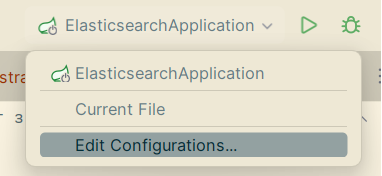
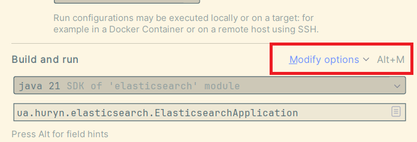
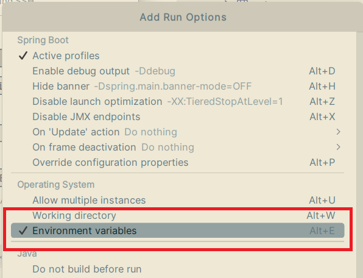
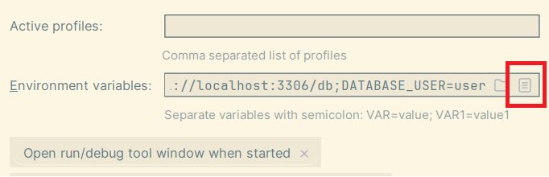
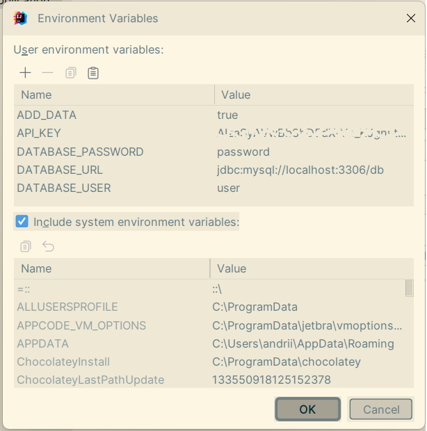

# docker-compose.yml

- db - БД MySQL
- odfe-node - нода ElasticSearch
- kibana - Kibana - для перегляду вмісту існуючих індексів ElasticSearch 
- logstash - для переносу вмісту таблиць БД MySQL в індекс ElasticSearch

Як виконується перенос даних:
logstash має файл налаштувань logstash.conf, який в нашому випадку складається з налаштувань двох плагінів: input i output.

**Input** використовується для налаштувань джерела даних. 
В нашому випадку ми підключаємось до реляційної БД MySQL, тому використовуємо JDBC інтерфейс.

Де крім параметрів підключення до БД (драйвера, рядка підключення, імені і пароля користувача)
також вказуємо і SQL запит за допомогою якого logstash буде отримувати дані з БД, а також
зміни якого поля він має аналізувати (tracking_column).

Завантаження даних відбувається періодично, для задання періодичності використовується 
параметр schedule в форматі UNIX cron

**Output** використовується для налаштування збереження даних. В нашому випадку ми використовуємо ElasticSearch.

В параметрах вказуємо в який індекс мають зберігатись дані. Щоб не створювати дублікати даних
використовуємо параметри document_id (ідентифікатор документа в ElasticSearch), а параметри 
doc_as_upsert і action відповідають за те, що робити коли документ з таким кодом вже є в БД.

# REST API

Добавлено 3 REST API (GET)
- отримання даних по назві - http://localhost:8080/api/v1/items/{name}
- отримання даних по назві категорії - http://localhost:8080/api/v1/items/category/{category}
- отримання даних по мінімальній і максимальній ціні - http://localhost:8080/api/v1/items/prices/{low}/{high}

В файлі test.http є приклади викликів.

Також АРІ можна протестувати в документації - http://localhost:8080/swagger-ui/index.html

# Передача чутливих даних до додатку

В випадку, якщо потрібно передати в додаток якісь дані, які можуть змінюватись в продуктиві, 
а також даних які не можуть бути показані іншим, навіть якщо це тестові дані, то бажано такі дані
передавати через змінні оточення.

Наприклад, нам потрібно передати в додаток пароль до БД. Цей пароль не можна прописувати в явному вигляді в 
якомусь properties файлі. Він має прописуватись в змінні оточення, а в properties файлі має 
використовуватись анотація типу ${DATABASE_PASSWORD}

В такому випадку ми:
- не захаркодимо цей пароль в properties файлі, який вважається частиною коду додатку;
- не покажемо цей пароль тим хто має доступ до нашого git репозиторію;
- надамо можливість встановлювати цей пароль таким який він є в реальності без зміну коду (пароль в середовищі розробки може бути один, в тестовому середовищі інший, а в продуктиві ще інший)

В JetBrain Idea змінні оточення можна встановити в конфігурації

Якщо додаток буде запускатись з командного рядку, то встанолюватись ці змінні мають так, як вони встановлюються в 
цьому, конкретному, командному рядку.

# Література
LogStash
- [Jdbc input plugin](https://www.elastic.co/guide/en/logstash/current/plugins-inputs-jdbc.html)
- [Filter plugins](https://www.elastic.co/guide/en/logstash/current/filter-plugins.html)
- [Elasticsearch output plugin](https://www.elastic.co/guide/en/logstash/current/plugins-outputs-elasticsearch.html)

Інтеграція Spring Boot i ElasticSearch
- [Elasticsearch with Spring Data and Spring Boot 3](https://howtodoinjava.com/spring-data/elasticsearch-with-spring-boot-data/)
- [A Powerful Alliance in Data Integration: Elasticsearch, Logstash, MySQL](https://sinan-karakaya.medium.com/a-powerful-alliance-in-data-integration-elasticsearch-logstash-mysql-and-spring-df8130ba248b)
- [Exploring Elasticsearch 8: Utilizing Spring Boot 3 and Spring Data Elasticsearch 5](https://medium.com/@truongbui95/exploring-elasticsearch-8-utilizing-spring-boot-3-and-spring-data-elasticsearch-5-495650115197)